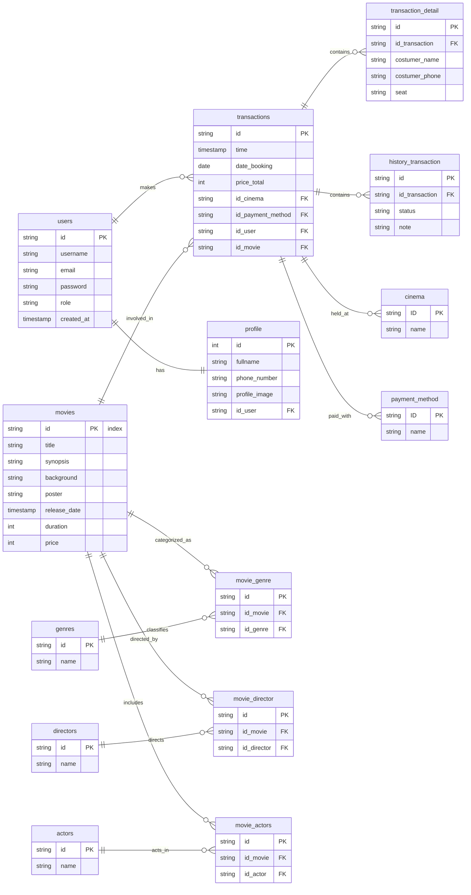

# Go Weekly Database With Express JS

Perform integration for Tickitz database using node technology and frameworks such as express and implement MVC design patterns, perform database connections using Sequilze and also postman to help interaction between endpoints.

## How to Install

Make sure you already install node to run this project

## How to Run this Project

1. Create a new empty directory for the project
2. Clone this project into the empty current directory:

```
git clone https://github.com/HN721/fgo24-express-tickitz.git .
```

3. Install dependencies

```
npm install
```

4. Run the project

```
node index.js --watch
```

## ERD Tickitz



## Depedencies

- Express JS
- JWT
- Sequilize
- NodeMailer
- Redis
- Docker

## Contributing

We welcome contributions! 🚀

If you would like to open a Pull Request (PR), please follow these steps:

1. Fork this repository.

2. Create a new branch:

```
git checkout -b feature/your-feature-name
```

3. Make your changes.

4. Commit your changes with a clear message:

```
git commit -m "Add: your featusre description"
Push your branch to your fork:
```

```
git push origin feature/your-feature-name
```

5. Open a Pull Request (PR) to the main branch of this repository.

6. Make sure your code is clean, well-tested, and consistent with the project style.

7. License
   This project is open-source and available under the MIT License.
